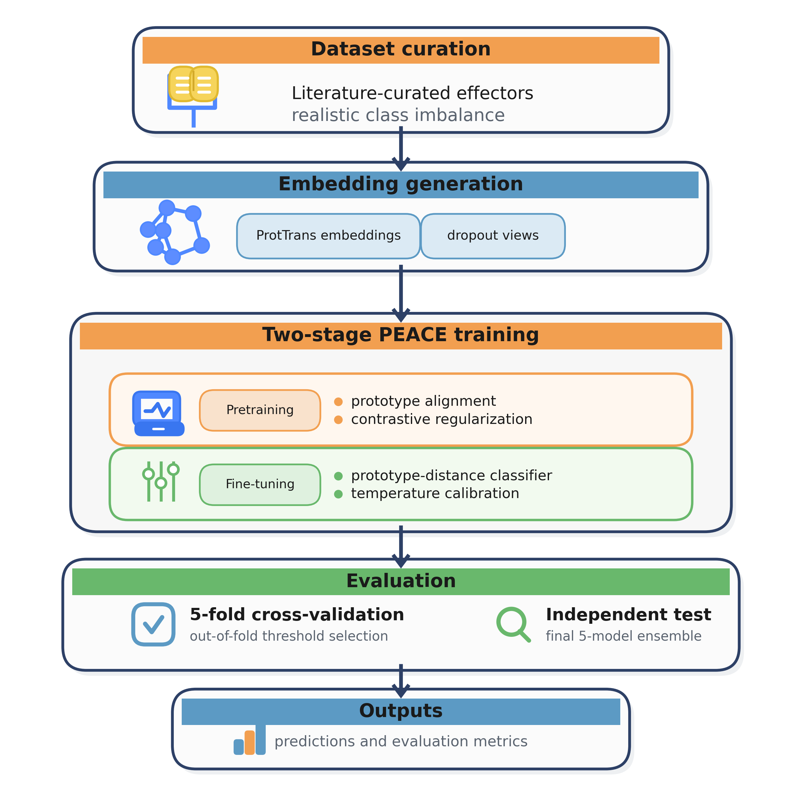
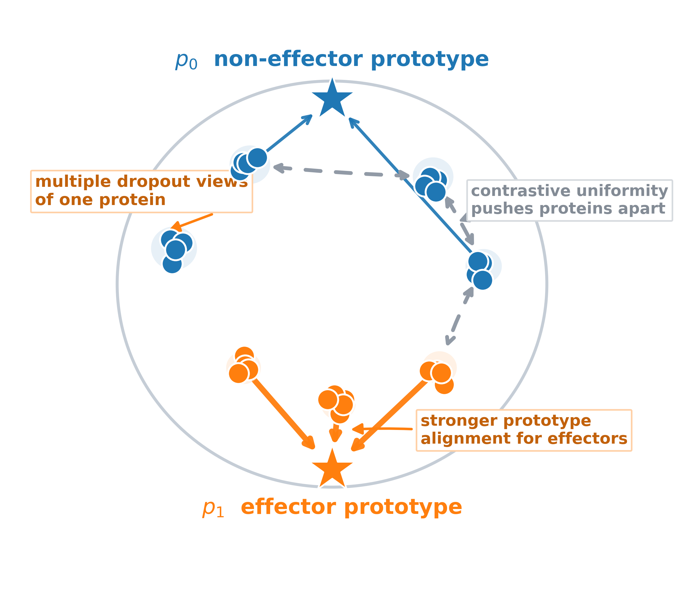

# PEACE: Prototype-aware Effector Analysis via Contrastive Embeddings

PEACE is a lightweight workflow for identifying candidate fungal and oomycete effector proteins from precomputed protein embeddings.

This repository accompanies the manuscript and provides:
- a low-code Google Colab path for fungi-only inference (recommended for most users),
- a command-line interface for training, evaluation, batch inference, and analysis.

## Why PEACE?

Effector discovery is a rare-event problem: in real secretomes, true effectors are uncommon, so even small false-positive rates can overwhelm downstream validation.

PEACE is designed for this setting. Instead of only optimizing a classifier boundary, it also shapes embedding geometry so:
- minority-class effectors form tighter clusters,
- majority non-effectors remain more dispersed,
- precision is improved in practical high-recall screening regimes.

## Method Overview (High Level)

PEACE combines three ideas:
1. **Protein language model embeddings** (ProtT5) as fixed sequence features.
2. **Prototype-aware contrastive representation learning** to organize latent space around effector/non-effector anchors.
3. **Calibrated prototype-distance classification** for final scoring.

In the two-stage workflow, representation learning happens first, then classification is fine-tuned on top of that structure.

For full model details, equations, and benchmarking context, see the citation below.

## Workflow Visualization

### End-to-end PEACE workflow



### Prototype-aware contrastive learning intuition



## Getting Started

### 1. Colab notebook (recommended)

If you prefer a low-code workflow, start with this notebook:

[](https://colab.research.google.com/github/Structurebiology-BNL/effector_prediction_with_contrastive_learning/blob/main/notebooks/fungus_inference_colab.ipynb)

Notebook in this repo: [`notebooks/fungus_inference_colab.ipynb`](notebooks/fungus_inference_colab.ipynb)

This notebook uses the bundled fungi-only model in `pretrained_models/fungus_model/`.

### 2. CLI (advanced / batch workflows)

Install and inspect commands:

```bash
uv sync --group dev
uv run effector-bincls --help
```

Common workflows:

```bash
# Baseline training / evaluation / analysis
uv run effector-bincls train-baseline --config src/configs/baseline_bce.yaml
uv run effector-bincls evaluate-baseline --run_dir <run_dir> --test_csv <csv> --threshold_method youden
uv run effector-bincls analyze-baseline --run_dir <run_dir>

# Prototype training / evaluation / inference / analysis
uv run effector-bincls train-prototype-single --config src/configs/prototype_single_stage.yaml
uv run effector-bincls train-prototype-two-stage --config src/configs/prototype_two_stage.yaml
uv run effector-bincls evaluate-prototype --run_dir <run_dir> --test_csv <csv> --threshold_method youden
uv run effector-bincls infer-prototype --embedding_dir <dir> --model_dir <run_dir>
uv run effector-bincls analyze-prototype --run_dir <run_dir>
```

Training and inference configs expect `data.embedding_dir` or `--embedding_dir` to point to a packed embedding dataset directory, not a folder of per-sequence `.npz` files. The packed dataset contract is:

- `embeddings.npy`: packed array with shape `[num_sequences, num_variants, embedding_dim]`
- `sequence_ids.txt`: sequence IDs in row order
- `metadata.json`: machine-readable metadata including `pooling_type` and `original_variant_index`

Detailed guides:
- [`docs/INFERENCE_GUIDE.md`](docs/INFERENCE_GUIDE.md)
- [`docs/VALIDATION_GUIDE.md`](docs/VALIDATION_GUIDE.md)
- [`docs/BASELINE_README.md`](docs/BASELINE_README.md)
- [`docs/PROTOTYPE_RANKING_README.md`](docs/PROTOTYPE_RANKING_README.md)
- [`docs/BASELINE_ANALYSIS_README.md`](docs/BASELINE_ANALYSIS_README.md)
- [`docs/PROTOTYPE_ANALYSIS_README.md`](docs/PROTOTYPE_ANALYSIS_README.md)

## Repository Map

- `src/effector_bincls/`: package code and CLI workflows
- `notebooks/`: Colab-first notebook interfaces
- `pretrained_models/`: bundled public model assets
- `src/configs/`: example configs for reproducible runs
- `docs/`: detailed workflow documentation

## Citation

This work is not yet published. Please use the following BibTeX placeholder for now:

```bibtex
@article{peace2026,
  title   = {PEACE: Prototype-aware Effector Analysis via Contrastive Embeddings},
  author  = {Dai, Xin and Lin, Yuewei and Yoo, Shinjae and Liu, Qun},
  year    = {2026},
  journal = {TBD},
  volume  = {TBD},
  number  = {TBD},
  pages   = {TBD},
  doi     = {TBD}
}
```
